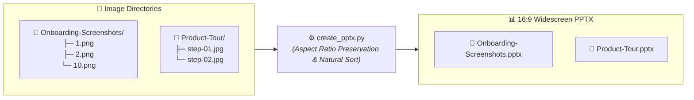

# Screenshots to PPTX Generator

> ⚡ **Zero-config automated Screenshot-to-PPTX generator for technical workflows & walkthroughs.**
> *"Drop your images, we create them into PPTX."*

---

## 🚀 Quickstart

### 1-Line Execution (via `uv`)
No environment setup or pre-installation needed:

```bash
uv run create_pptx.py
```

### Alternative: Standard Python & Pip
```bash
# 1. Install dependencies
pip install python-pptx pillow

# 2. Run generator
python create_pptx.py
```

---

## 🖼️ Visual Workflow



---

## ✨ Features

- **16:9 Widescreen Modern Layout**: Native `13.333" x 7.5"` slides optimized for high-resolution displays.
- **Dedicated Cover / Title Slide**: Automatically styled hero slide displaying folder title and total slide count.
- **Natural Numeric Sorting**: Intelligently orders files containing numbers (`1.jpg`, `2.jpg` ... `10.jpg`, `12.jpg`).
- **Clean Title Headers**: Formatted image labels with breadcrumb index counters (e.g. `Slide 1 of 12 - 1.png`).
- **Aspect Ratio Preservation**: Centered dynamic scaling ensuring screenshots are never stretched or distorted.
- **Wide Format Support**: Compatible with `.png`, `.jpg`, `.jpeg`, `.webp`, `.bmp`, `.gif`, and `.tiff`.

---

## 📂 Directory Structure

```text
.
├── create_pptx.py               # Main Screenshot-to-PPTX generator
├── README.md                    # Project documentation & usage guide
├── AGENTS.md                    # Root agent workflow contract
├── autonomous-coding-agents/    # Inem workflow submodule (READ-ONLY)
├── Onboarding-Screenshots/      # Source image folder
│   ├── 1.png
│   └── 2.png
├── Onboarding-Screenshots.pptx  # Auto-generated presentation
├── Product-Tour/                # Source image folder
│   └── 1.png
└── Product-Tour.pptx            # Auto-generated presentation
```

---

## 🤖 Autonomous Agent Integration

This repository implements the **`inem`** (`i` → `n` → `e` → `m`) autonomous agent execution method:

- Consult [`AGENTS.md`](./AGENTS.md) for root workflow lifecycle commands (`i`, `n`, `e`, `t`, `f`, `c`, `r`, `d`, `m`).
- Submodule standards and skill references: [`autonomous-coding-agents/`](./autonomous-coding-agents/AGENTS.md).
- Adheres to test-driven evolution, ≤256 LOC per file limit, and automated verification.
